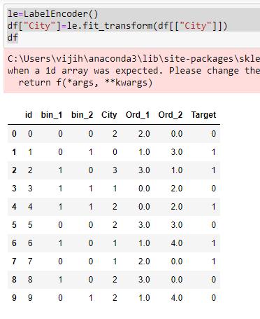
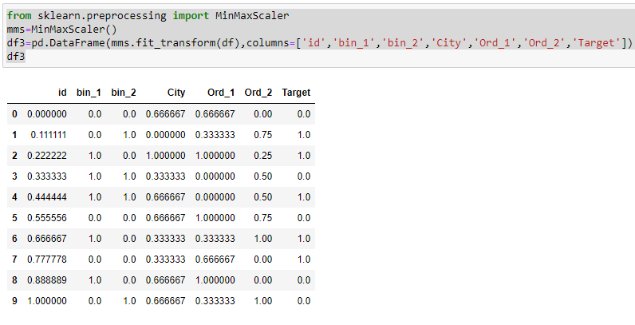

# EX-05-Feature-Generation


## AIM
To read the given data and perform Feature Generation process and save the data to a file. 

# Explanation
Feature Generation (also known as feature construction, feature extraction or feature engineering) is the process of transforming features into new features that better relate to the target.
## FEATURE CODING
### 1.Ordinal Encoding
An ordinal encoding involves mapping each unique label to an integer value. This type of encoding is really only appropriate if there is a known relationship between the categories. This relationship does exist for some of the variables in our dataset, and ideally, this should be harnessed when preparing the data.

### 2.Label Encoding
Label encoding is a simple and straight forward approach. This converts each value in a categorical column into a numerical value. Each value in a categorical column is called Label.

### 3.Binary Encoding
Binary encoding converts a category into binary digits. Each binary digit creates one feature column. If there are n unique categories, then binary encoding results in the only log(base 2)ⁿ features.

### 4.One Hot Encoding
We use this categorical data encoding technique when the features are nominal(do not have any order). In one hot encoding, for each level of a categorical feature, we create a new variable. Each category is mapped with a binary variable containing either 0 or 1. Here, 0 represents the absence, and 1 represents the presence of that category.
## FEATURE SCALING
### 1.Standard Scaler
It is also called Z-score normalization. It calculates the z-score of each value and replaces the value with the calculated Z-score. The features are then rescaled with x̄ =0 and σ=1

### 2.MinMaxScaler
It is also referred to as Normalization. The features are scaled between 0 and 1. Here, the mean value remains same as in Standardization, that is, 0.

### 3.Maximum absolute scaling
Maximum absolute scaling scales the data to its maximum value; that is, it divides every observation by the maximum value of the variable.The result of the preceding transformation is a distribution in which the values vary approximately within the range of -1 to 1.

### 4.RobustScaler
RobustScaler transforms the feature vector by subtracting the median and then dividing by the interquartile range (75% value — 25% value).
 

# ALGORITHM
### STEP 1
Read the given Data
### STEP 2
Clean the Data Set using Data Cleaning Process
### STEP 3
Apply Feature Generation techniques to all the feature of the data set
### STEP 4
Save the data to the file


# CODE

## CODING FOR DATA.CSV
```
import pandas as pd
df=pd.read_csv("data.csv")
df
pip install --upgrade category_encoders
import category_encoders as ce
from category_encoders import BinaryEncoder
be1=BinaryEncoder()
be1.fit_transform(df["bin_2"])
df["bin_2"]=be1.fit_transform(df[["bin_2"]])
df
from sklearn.preprocessing import LabelEncoder,OrdinalEncoder
temp=["Cold","Warm","Hot","Very Hot"]
enc=OrdinalEncoder(categories=[temp])
df["Ord_1"]=enc.fit_transform(df[["Ord_1"]])
df
education=["High School","Diploma","Bachelors","Masters","PhD"]
ed=OrdinalEncoder(categories=[education])
df["Ord_2"]=ed.fit_transform(df[["Ord_2"]])
df
from sklearn.preprocessing import OneHotEncoder
ohe=OneHotEncoder(sparse=False)
ohe.fit_transform(df[["City"]])
from category_encoders import TargetEncoder
te=TargetEncoder()
te.fit_transform(X=df['Ord_1'],y=df["Target"])
le=LabelEncoder()
df["City"]=le.fit_transform(df[["City"]])
df
from sklearn.preprocessing import StandardScaler
std=StandardScaler()
df1=pd.DataFrame(std.fit_transform(df),columns=['id','bin_1','bin_2','City','Ord_1','Ord_2','Target'])
df1
from sklearn.preprocessing import MaxAbsScaler
maxabs=MaxAbsScaler()
df2=pd.DataFrame(maxabs.fit_transform(df),columns=['id','bin_1','bin_2','City','Ord_1','Ord_2','Target'])
df2
from sklearn.preprocessing import MinMaxScaler
mms=MinMaxScaler()
df3=pd.DataFrame(mms.fit_transform(df),columns=['id','bin_1','bin_2','City','Ord_1','Ord_2','Target'])
df3
from sklearn.preprocessing import RobustScaler
rs=RobustScaler()
df4=pd.DataFrame(rs.fit_transform(df),columns=['id','bin_1','bin_2','City','Ord_1','Ord_2','Target'])
df4
```
## CODING FOR ENCODING_DATA.CSV
```
import pandas as pd
df=pd.read_csv("Encoding Data.csv")
df
from sklearn.preprocessing import LabelEncoder,OrdinalEncoder
temp=["Cold","Warm","Hot"]
end=OrdinalEncoder(categories=[temp])
df["ord_2"]=end.fit_transform(df[["ord_2"]])
df
from category_encoders import BinaryEncoder
be=BinaryEncoder()
df['bin_1']=be.fit_transform(df[['bin_1']])
df
BE1=BinaryEncoder()
df['bin_2']=BE1.fit_transform(df[['bin_2']])
df
from sklearn.preprocessing import OneHotEncoder
ohe=OneHotEncoder(sparse=False)
ohe.fit_transform(df[["nom_0"]])
le=LabelEncoder()
df["nom_0"]=le.fit_transform(df[["nom_0"]])
df
from sklearn.preprocessing import MinMaxScaler
mms=MinMaxScaler()
df1=pd.DataFrame(mms.fit_transform(df),columns=['id','bin_1','bin_2','nom_0','Ord_2'])
df1
from sklearn.preprocessing import MaxAbsScaler 
mas=MaxAbsScaler()
df2=pd.DataFrame(mas.fit_transform(df),columns=['id','bin_1','bin_2','nom_0','Ord_2'])
df2
from sklearn.preprocessing import RobustScaler
rs=RobustScaler()
df3=pd.DataFrame(rs.fit_transform(df),columns=['id','bin_1','bin_2','nom_0','Ord_2'])
df3
from sklearn.preprocessing import StandardScaler
sc=StandardScaler()
df4=pd.DataFrame(sc.fit_transform(df),columns=['id','bin_1','bin_2','nom_0','Ord_2'])
df4

```
## CODING FOR TITANIC_DATASET.CSV
```
import pandas as pd
df=pd.read_csv("titanic_dataset.csv")
df
df.isnull().sum()
df["Age"]=df["Age"].fillna(df["Age"].median())
df["Embarked"]=df["Embarked"].fillna(df["Embarked"].mode()[0])
df
df.drop("Cabin",axis=1,inplace=True)
df.drop("Ticket",axis=1,inplace=True)
df.drop("Name",axis=1,inplace=True)
df.isnull().sum()
df
df["Age"]=df["Age"].fillna(df["Age"].median())
df["Embarked"]=df["Embarked"].fillna(df["Embarked"].mode()[0])
df.isnull().sum()
df
df.isnull().sum()
df
from category_encoders import BinaryEncoder
be=BinaryEncoder()
df["Sex"]=be.fit_transform(df[["Sex"]])
df1=be.fit_transform(df["Sex"])
df1
from sklearn.preprocessing import MinMaxScaler
sc=MinMaxScaler()
df2=pd.DataFrame(sc.fit_transform(df1),columns=['Passenger','Survived','Pclass','Sex','Age','SibSp','Parch','Fare','Embarked'])
df2
from sklearn.preprocessing import StandardScaler
std=StandardScaler()
df3=pd.DataFrame(std.fit_transform(df1),columns=['Passenger','Survived','Pclass','Sex','Age','SibSp','Parch','Fare','Embarked'])
df3
from sklearn.preprocessing import MaxAbsScaler
max=MaxAbsScaler()
df4=pd.DataFrame(max.fit_transform(df1),columns=['Passenger','Survived','Pclass','Sex','Age','SibSp','Parch','Fare','Embarked'])
df4
from sklearn.preprocessing import RobustScaler
rs=RobustScaler()
df5=pd.DataFrame(rs.fit_transform(df1),columns=['Passenger','Survived','Pclass','Sex','Age','SibSp','Parch','Fare','Embarked'])
df5
```

# OUTPUT

## 1) Data.csv








## 2) Encoding_Data.csv


## 3) Titanic_dataset.csv


# RESULT
Feature Encoding process and Feature Scaling process is applied to the given data frame sucessfully.